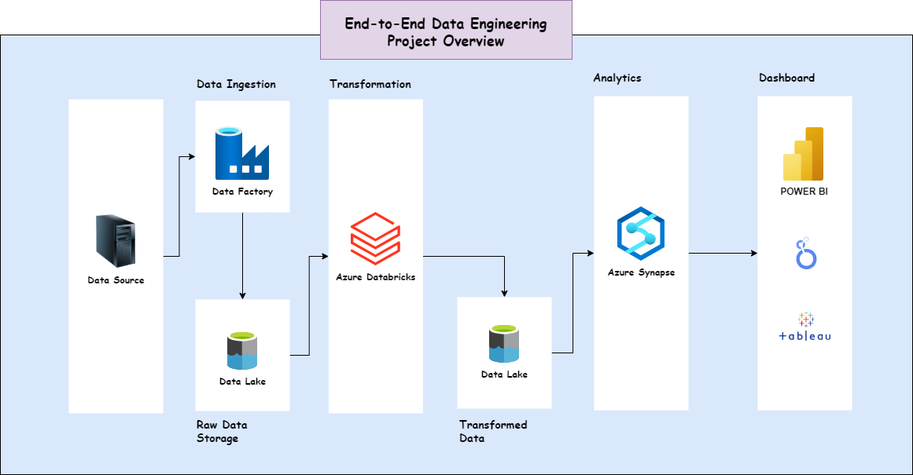

# End-to-end Azure Data Engineering project using Olympics Data




## Project Overview
End-to-end Azure data engineering project involves:

1. **Data Ingestion:** Extracting Olympic data from a GitHub repository using Azure Data Factory.
2. **Data Storage:** Storing raw data in Azure Data Lake Storage (Gen2).
3. **Data Transformation:** Using Azure Databricks to clean and transform the data (e.g., schema correction, filtering).
4. **Data Analysis:** Leveraging Azure Synapse Analytics for SQL-based analytics and visualization (Power BI).

**Key Steps**

1. **Azure Setup:**
    - Create a Storage Account (Azure Data Lake Gen2) with containers for raw/transformed data.
    - Set up Azure Data Factory to build pipelines for copying data from GitHub to the Data Lake.
    - Configure Azure Databricks to run Spark transformations and write results back to the Data Lake.
    - Use Azure Synapse Analytics for querying transformed data.

2. **Data Flow:**
    - **Ingestion:** Data Factory copies CSV files (athletes, coaches, medals, etc.) from GitHub to the raw folder.
    - **Transformation:** Databricks reads raw data, fixes schemas (e.g., converting string columns to integers), and writes processed data to the transform folder.
    - **Analysis:** Synapse Analytics queries the transformed data.

3. **Technical Details:**
    - **Data Factory:** Uses HTTP connectors for GitHub and Azure Blob Storage for the Data Lake.
    - **Databricks:** Mounts Data Lake via service principal (App Registration), handles lazy evaluation, and partitions output files.
    - **Spark Operations:** withColumn() for schema fixes, orderBy() for sorting, and repartition() for file output control.

**Prerequisites**
- Azure free trial account (12 months, $200 credit).
- Basic knowledge of Python, SQL, and Spark.

**Architecture**
```
GitHub (API) → Azure Data Factory → Raw Data Lake → Databricks (Spark) → Transformed Data Lake → Synapse Analytics → Power BI
Ready for your questions! Ask about specific steps (e.g., pipeline creation, Spark code), troubleshooting (e.g., mounting errors), or tool comparisons (e.g., Data Factory vs. Synapse).
```

## Azure Account and Services Overview
1. **Azure Account**

    An Azure Account is your access point to Microsoft’s cloud platform, Azure. It includes:

    Free Tier:
    - 12 months of free access to popular services (e.g., Virtual Machines, Databases).
    - $200 credit for 30 days to explore paid services.
    - Requires a credit card for identity verification (no charges unless you upgrade).


2. **Key Azure Services for Data Engineering
The project uses these core services:**

    A. **Azure Data Factory (ADF)**

    - **Purpose:**
        - Serverless ETL/ELT tool to orchestrate data pipelines.

        - Extracts data from sources (e.g., GitHub APIs, databases) and loads it into storage.

    - **Features:**
        - Drag-and-drop interface for pipeline design.

        - Supports 90+ connectors (HTTP, Blob Storage, SQL, etc.).

        - Example: Copies CSV files from GitHub to Azure Data Lake.

    B. **Azure Data Lake Storage Gen2**
    
    - **Purpose:**
        - Scalable object storage optimized for big data analytics.

        - Combines features of Azure Blob Storage with a hierarchical file system (like folders).

    - **Use Case:**

        - Stores raw data (from GitHub) and transformed data (processed by Databricks).

    C. **Azure Databricks**

    - **Purpose:**
        - Managed Apache Spark platform for data transformation and ML.

        - Collaborative notebooks (Python/SQL) with auto-scaling clusters.

    - **Key Steps:**
        - Mounts Data Lake to access files.
        - Uses Spark to clean data (e.g., fix column types, remove duplicates).
        - Writes results back to Data Lake.

    D. **Azure Synapse Analytics**
    
    - **Purpose:**
        - Unified analytics service for SQL-based querying and visualization.
        - Integrates with Power BI for dashboards.
    - **Use Case:**
        - Queries transformed data (e.g., "Which country won the most gold medals?").

    E. **Other Supporting Services**
    
    - **Azure Active Directory (AAD):**
        - Manages authentication (e.g., App Registration for Databricks-to-Data Lake access).
    - **Key Vault:**
        - Securely stores secrets (e.g., API keys, connection strings).

3. **How Services Interact**

- Data Flow:
```
GitHub → Data Factory → Data Lake (Raw) → Databricks → Data Lake (Transformed) → Synapse.
```

- Authentication:

    Databricks uses an App Registration (AAD) to access Data Lake via OAuth.

4. Comparison to Other Clouds
### **Cloud Service Comparison**

| Service Category       | Azure Service           | AWS Equivalent       | Google Cloud Equivalent |
|------------------------|-------------------------|----------------------|-------------------------|
| **ETL/Orchestration**  | Azure Data Factory      | AWS Glue             | Cloud Dataflow          |
| **Data Lake Storage**  | Data Lake Storage Gen2  | S3 + Lake Formation  | Cloud Storage           |
| **Spark Processing**   | Azure Databricks        | EMR (Elastic MapReduce) | Dataproc              |
| **Data Warehouse**     | Synapse Analytics       | Redshift             | BigQuery               |
| **Serverless Compute** | Azure Functions         | AWS Lambda           | Cloud Functions         |
| **Identity Management**| Azure Active Directory  | AWS IAM              | Cloud Identity          |
| **Secrets Management** | Azure Key Vault         | AWS Secrets Manager  | Secret Manager          |
| **Workflow Scheduling**| Azure Logic Apps        | AWS Step Functions   | Cloud Composer          |

5. **Why Azure for Data Engineering?**
    - **Integration:** Tight coupling between services (e.g., Synapse includes Data Factory).
    - **Scalability:** Auto-scaling in Databricks/Data Lake.
    - **Security:** AAD and Key Vault for access control.

**Example:** In the project, Azure’s unified tools simplify moving from raw data (GitHub) to insights (Synapse/Power BI) with minimal manual effort.

## What is an Azure Storage Account?
An Azure Storage Account is a secure, scalable cloud storage service that provides a namespace (unique URL) to manage data in Azure. It supports multiple storage types:

1. **Blob Storage:** For unstructured data (e.g., CSV, JSON, images).
2. **Data Lake Storage Gen2:** Hierarchical storage (folders) optimized for analytics (built on Blob Storage).
3. **File Shares:** Network file systems (like SMB/NFS).
4. **Tables/Queues:** For NoSQL and messaging.

### Why Do We Need It in Data Engineering?
1. **Centralized Raw Data Storage**

    - Ingests data from APIs (e.g., GitHub), databases, or IoT devices into a single location (raw container).
    - Example: In the project, Olympic CSV files from GitHub are first stored here.

2. **Staging for Transformed Data**

    - After processing (e.g., Spark transformations in Databricks), cleaned data is saved to a transform container.

3. **Integration with Analytics Tools**

    - Synapse Analytics/Power BI directly query data from Storage Account.
    - Example: Synapse reads transformed CSV files for SQL analysis.

4. **Cost-Effective Scalability**

    - Pay only for used storage (hot/cool/archive tiers).
    - Handles petabytes of data without infrastructure management.

5. **Security & Access Control**
    - Azure Active Directory (AAD) and Shared Access Signatures (SAS) restrict data access.
    - Project Use Case: App Registration credentials (from AAD) let Databricks securely access the Data Lake.

6. **Data Lake Capabilities (Gen2)**

    - Enables folder structures (e.g., /raw/olympic_2021/) for organized data governance.
    - Optimized for Apache Spark/Hadoop workloads (used in Databricks).

### Key Features Used in the Project

|Feature |	Purpose|
---------|----
|Containers|	Isolate raw vs. transformed data (e.g., raw-data vs. transform).
Hierarchical Namespace |	Folders mimic local file systems (critical for Spark workflows).
HTTP/API | Access	Data Factory pulls CSV files from GitHub via HTTP into Blob Storage.
Mounting |	Databricks mounts Storage Account as a local drive for Spark processing.

### Comparison to Other Cloud Storage

| Cloud Provider |	Equivalent Service	| Key Difference|
------|--------|-----
AWS |	S3 + Lake Formation	| Azure integrates Blob + Data Lake Gen2.
Google Cloud |	Cloud Storage |	Lacks native folder-level optimization.

### Summary
A Storage Account is the foundation of Azure data projects:
- Acts as a landing zone for raw data.
- Enables seamless integration with ETL (Data Factory), processing (Databricks), and analytics (Synapse).
- Provides security, scalability, and cost control.

In the Olympic data project, it’s the "single source of truth" for all pipeline stages.

## What is a Container in Azure Storage?
A container in Azure Storage is a logical unit (similar to a folder or bucket) that organizes blobs (files) within a Storage Account. It acts as a top-level directory to group related files together, enforce access policies, and manage data lifecycle.

### Why Are Containers Used in Data Engineering?
1. **Organize Data by Purpose**

    - Example in the Olympic project:

        - `raw-data`: Stores unprocessed CSV files from GitHub.
        - `transform`: Holds cleaned data after Spark processing.

2. **Access Control**

    - Permissions (read/write/delete) are set at the container level via:

        - Azure Active Directory (AAD)
        - Shared Access Signatures (SAS).

3. **Lifecycle Management**

    - Apply rules to automatically delete/move old data (e.g., archive raw files after 30 days).

4. **Integration with Analytics Tools**

    - Synapse/Databricks reference containers to read/write data (e.g., wasbs://transform@storageaccount.dfs.core.windows.net/olympic_medals).

### Key Properties
Property |	Description
---|---
Name |	Must be lowercase, hyphens, and numbers (e.g., raw-data).
Access Tier |	Hot (frequent access), Cool (infrequent), or Archive (long-term backup).
Immutable Blobs |	Legal/compliance feature to prevent data deletion/modification.

### Example in the Project
1. **Data Ingestion**
    
    Data Factory copies GitHub CSVs to the raw-data container.

```python
# Example path in Data Factory pipeline
wasbs://raw-data@olympicstorage.blob.core.windows.net/athletes.csv
```
2. **Data Processing**

    Databricks reads from raw-data, processes data, and writes to transform.

```python
# Mounting the container in Databricks
dbutils.fs.mount(
  source = "wasbs://transform@olympicstorage.blob.core.windows.net",
  mount_point = "/mnt/transform"
)
```

3. **Data Analysis**

    Synapse queries files in the transform container.

```sql
-- Synapse SQL query
SELECT * FROM OPENROWSET(
  BULK 'https://olympicstorage.dfs.core.windows.net/transform/medals.parquet',
  FORMAT = 'PARQUET'
) AS data
```

### Containers vs. Folders
Feature |	Container |	Folder (Inside Container)
---|---|---
Scope |	Top-level in Storage Account. |	Nested under a container.
Permissions |	Set at container level. |	Inherits container permissions.
Use Case |	Separate raw/transformed data. |	Organize files (e.g., /raw/2023/).

### Best Practices
1. **Naming Conventions**
    - Use clear names like landing-zone, curated-data, or backup.
2. **Limit Public Access**
    - Default to private containers; enable public access only if needed.
3. **Versioning**
    - Enable blob versioning to track file changes over time.

### Comparison to Other Clouds
Cloud Provider |	Equivalent to Azure Container
---|---
AWS	S3 Bucket |
Google Cloud |	Cloud Storage Bucket

### Summary
Containers are essential in Azure data projects because they:

- Provide logical separation for different data stages (raw/processed).
- Simplify security and access management.
- Enable seamless integration with Azure services (Data Factory, Databricks, Synapse).

In the Olympic project, raw-data and transform containers ensure clean data isolation and pipeline efficiency.

## Azure Data Factory: Overview

### **What is Azure Data Factory?**
Azure Data Factory (ADF) is a **cloud-based ETL/ELT service** for orchestrating and automating data pipelines. It enables:
- **Data movement** between on-premises and cloud sources.
- **Data transformation** using compute services (Databricks, HDInsight).
- **Monitoring** of pipeline execution.

### **Key Components**
| Component         | Purpose                                                                 |
|-------------------|-------------------------------------------------------------------------|
| **Pipelines**     | Logical group of activities that perform a task (e.g., ingest → transform). |
| **Activities**    | Individual actions (Copy, Spark, SQL Stored Proc).                      |
| **Datasets**      | Named views of data (e.g., `athletes.csv` in Blob Storage).             |
| **Linked Services** | Connection strings to external data sources (GitHub, SQL DB, etc.).   |
| **Triggers**      | Schedule or event-based pipeline execution.                             |

### **Why Use It in Data Engineering?**
1. **Serverless Integration**  
   - No infrastructure to manage; scales automatically.  
2. **Hybrid Data Support**  
   - Connects to 90+ sources (APIs, databases, files).  
3. **Code-Free or Code-Friendly**  
   - Visual UI or JSON/Python SDK for pipeline authoring.  
4. **Cost-Effective**  
   - Pay only for pipeline execution time.  

### **Example in Olympic Project**
1. **Ingestion Pipeline**  
   - Copies CSV files from GitHub → Azure Data Lake (raw container).  
   ```json
   {
     "name": "CopyOlympicData",
     "type": "Copy",
     "inputs": [{"referenceName": "GitHubHTTP"}],
     "outputs": [{"referenceName": "RawDataLake"}]
   }

2. **Transformation triggers**
    - Runs Databricks notebook after ingestion completes.

### Comparison to Other Tools
Tool |	Azure Data Factory vs. Alternatives
---|---
AWS Glue |	ADF offers tighter Azure integration (Synapse, Databricks).
Apache Airflow |	ADF is fully managed; Airflow requires self-hosting.
SSIS |	ADF is cloud-native; SSIS is legacy (on-premises).

## Linked Service in Azure Data Factory

### **What is a Linked Service?**
A **Linked Service** in Azure Data Factory (ADF) is a connection string that defines:
- **Source/Target Connection**: How ADF connects to external data stores (e.g., GitHub, Azure SQL, Blob Storage).
- **Authentication Details**: Credentials, keys, or service principals to access the data.
- **Integration Runtime**: Specifies where the compute happens (Azure, self-hosted).

> Think of it as a "bridge" between ADF and your data sources/destinations.

---

### **Why Needed for GitHub Ingestion?**
When you created a pipeline to ingest data from GitHub:
1. **Linked Service for GitHub (HTTP)**  
   - Defined the GitHub API endpoint (`https://raw.githubusercontent.com/...`).  
   - Set authentication to `Anonymous` (since GitHub raw URLs are public).  
   - Specified file format (CSV/JSON).  

2. **Linked Service for Azure Data Lake**  
   - Connected to your Storage Account using Azure credentials.  
   - Specified the container (`raw-data`) and path.  

---

### **Key Properties**
| Property          | Example (GitHub)                          | Example (Azure Data Lake)               |
|-------------------|------------------------------------------|------------------------------------------|
| **Type**          | `HTTP`                                   | `AzureBlobStorage` or `AzureDataLakeStorageGen2` |
| **Base URL**      | `https://raw.githubusercontent.com/user/repo/` | `https://storageaccount.blob.core.windows.net` |
| **Authentication**| `Anonymous`                              | `Account Key` / `Service Principal`      |
| **File Format**   | `DelimitedText` (CSV)                    | `Parquet` / `Avro`                       |

---
## Azure Data Warehouse vs. Azure Databricks: Key Differences

### **1. Azure Synapse Analytics (Data Warehouse)**
#### **Purpose**
- **OLAP (Analytics)**: Optimized for large-scale SQL-based data warehousing and reporting.
- **Structured Data**: Stores processed, schema-enforced data (star/snowflake schemas).

#### **Key Features**
| Feature                | Description                                                                 |
|------------------------|-----------------------------------------------------------------------------|
| **SQL-Centric**        | Run T-SQL queries on petabytes of data (MPP architecture).                 |
| **Integration**        | Native connectors to Power BI, Azure Data Factory.                         |
| **Deployment Models**  | Dedicated SQL Pools (provisioned) or Serverless (pay-per-query).           |
| **Use Case**          | Business reporting, dashboards, historical analysis.                       |

**Example (Olympic Project)**:
```sql
-- Synapse SQL query to analyze medal counts
SELECT country, SUM(gold) AS total_gold
FROM olympic_medals
GROUP BY country
ORDER BY total_gold DESC;
```

### 2. Azure Databricks
#### Purpose
- **Data Engineering & ML:** Unified platform for Apache Spark-based big data processing and machine learning.
- **Unstructured/Semi-Structured Data:** Handles raw JSON, CSV, streaming data.

#### Key Features
Feature	| Description
---|---
Spark-Based |	Distributed processing with Python/Scala/R.
Notebooks |	Collaborative coding (Jupyter-style) with auto-scaling clusters.
Delta Lake |	ACID transactions for data lakes (merge/update/delete support).
Use Case |	Data cleaning, real-time streaming, ML model training.

#### Example (Olympic Project):

```python
# Databricks notebook to clean athlete data
from pyspark.sql.functions import *
df_athletes = spark.read.csv("/mnt/raw-data/athletes.csv", header=True)
df_clean = df_athletes.dropDuplicates().withColumn("year", lit(2021))
df_clean.write.parquet("/mnt/transform/athletes_clean")
```

#### Comparison Table
Criteria |	Azure Synapse (Data Warehouse) |	Azure Databricks
---|---|---
Primary Use |	SQL analytics, reporting |	Big data processing, ML
Compute Engine |	Massively Parallel Processing (MPP)	|Apache Spark
Data Structure |	Schema-on-write (structured)	|Schema-on-read (flexible)
Programming |	T-SQL	| Python/Scala/R/SQL
Cost Model |	Pay for provisioned DWUs or per query	| Pay for cluster runtime
Best For |	Business intelligence, dashboards |	ETL, streaming, machine learning

#### How They Work Together
1. **Databricks for Transformation**
    - Cleans raw Olympic data (e.g., fix schemas, deduplicate).
    - Outputs structured data to Data Lake.

2. **Synapse for Analysis**
    - Queries transformed data to generate insights (e.g., medal rankings).
    - Feeds results to Power BI.

#### Architecture Flow:
```
GitHub → Data Factory → Data Lake (Raw) → Databricks → Data Lake (Cleaned) → Synapse → Power BI
```

#### When to Use Which?
- **Choose Synapse if:**
    - You need SQL-based analytics with high concurrency.
    - Your team prefers T-SQL over Python/Scala.

- **Choose Databricks if:**
    - You’re processing unstructured data or building ML models.
    - You need Spark’s flexibility for complex transformations.

**Note:** In modern architectures (like the Olympic project), both are often used together—Databricks for heavy lifting and Synapse for governed analytics.

## Step-by-Step Implementation Guide

This section provides detailed instructions for implementing this project from scratch.

### 1. Create Azure Storage Account

1. **Create storage account**
   - Select your Subscription
   - Create Resource group (e.g., `tokyo-olympic`)
   - Enter a unique storage account name (e.g., `mytokyoolympicdata`)
   - Check **Enable hierarchical namespace** (required for Data Lake Gen2)
   - Keep clicking next until create

2. **Create a container**
   - Enter container name (e.g., `tokyoolympicdata`)
   - Navigate to that container
   - Create two directories:
     - `raw-data`: For storing unprocessed data
     - `transformed-data`: For storing processed data

### 2. Set Up Azure Data Factory

1. **Create Data Factory**
   - Search for Azure Data Factory in the Azure portal
   - Select your Subscription
   - Select resource group created earlier
   - Enter a name (e.g., `our-tokyo-olympics-df`)
   - Keep clicking next until create

2. **Create Data Pipeline**
   - Click on "Launch Studio" button to launch the newly created data factory
   - On the left-hand panel click on Author
   - Click on the + icon and select "Pipeline"
   - Give it a name (e.g., "data-ingestion")

3. **Data Ingestion Setup**
   - From Activities panel, search "Copy data" and drag it onto the canvas
   - In the General tab, name it "Athletes" (matching the source file name)
   - Configure Source tab:
     - Click "+ New" button
     - Search for **HTTP** (for GitHub data sources)
     - Select **DelimitedText** format and click continue
     - Name it "Athletes"
     - Create New Linked Service named "AthletesHTTP"
     - Enter the GitHub raw file URL (e.g., `https://raw.githubusercontent.com/theatashaikh/end-to-end-azure-data-engineering-and-analytics-project/main/data/Athletes.csv`)
     - Set Authentication type to "Anonymous" (for public repositories)
     - Check "First row as header" if applicable
     - Preview data to verify
   - Configure Sink tab:
     - Click "+ New" button
     - Search for "Azure Data Lake Storage Gen2" and select "DelimitedText"
     - Name it "ADLS"
     - Create a New Linked Service
     - Select your subscription and storage account
     - Browse to your `raw-data` directory and set filename to `athletes.csv`
     - Click "Debug" to run the pipeline

   > **Note**: Repeat this process for each CSV file in the GitHub repository. Reuse the same sink Linked Service for all files.

### 3. Set Up Azure Databricks

1. **Create Azure Databricks Workspace**
   - Search for Azure Databricks in the portal
   - Click "+ Create Azure databricks service"
   - Select subscription and resource group
   - Give a workspace name (e.g., `my-tokyo-olympic-db`)
   - Keep clicking next until create
   - Launch the workspace

2. **Create Compute in Azure Databricks**
   - On the left panel, click **Compute**
   - Click **Create Compute**
   - Set Policy to Unrestricted
   - Select Single node
   - Keep default Runtime version
   - Click Create

3. **Create Notebook**
   - Click the "+ New" menu on the left panel
   - Select "Notebook"
   - Name it "Tokyo Olympic Transformation"
   - Connect to your cluster

### 4. Set Up Storage Access for Databricks

1. **Create App Registration**
   - Search "App Registrations" in the Azure portal
   - Click "New Registration"
   - Enter a name (e.g., "app01")
   - Click Register
   - Copy these values:
     - Application (client) ID
     - Directory (tenant) ID

2. **Create Client Secret**
   - Go to "Certificates & secrets" under "Manage"
   - Click "+ New client secret"
   - Enter a description (e.g., "secretkey")
   - Click Add
   - **Important**: Copy the secret value immediately (you won't see it again)

3. **Assign Storage Role**
   - Go to your storage account
   - Click "Access Control (IAM)"
   - Click "+ Add" then "Add role assignment"
   - Select "Storage Blob Data Contributor" role
   - Click Next
   - Click "+ Select Members"
   - Search for your app (e.g., "app01")
   - Select it and click "Select"
   - Click through to "Review + Assign"

### 5. Connect Databricks to Storage

In your Databricks notebook, add this code (replace with your values):

```python
configs = {
    "fs.azure.account.auth.type": "OAuth",
    "fs.azure.account.oauth.provider.type": "org.apache.hadoop.fs.azurebfs.oauth2.ClientCredsTokenProvider",
    "fs.azure.account.oauth2.client.id": "your_client_id",
    "fs.azure.account.oauth2.client.secret": "your_secret",
    "fs.azure.account.oauth2.client.endpoint": "https://login.microsoftonline.com/your_tenant_id/oauth2/token"
}

dbutils.fs.mount(
    source="abfss://tokyoolympicsdata@mytokyoolympicdata.dfs.core.windows.net",
    mount_point="/mnt/tokyoolympic",
    extra_configs=configs
)

# Read the CSV files from raw-data
athletes = spark.read.csv("/mnt/tokyoolympic/raw-data/athletes.csv", header=True)
coaches = spark.read.csv("/mnt/tokyoolympic/raw-data/coaches.csv", header=True)
entriesgender = spark.read.csv("/mnt/tokyoolympic/raw-data/entries-gender.csv", header=True)
medals = spark.read.csv("/mnt/tokyoolympic/raw-data/medals.csv", header=True)
teams = spark.read.csv("/mnt/tokyoolympic/raw-data/teams.csv", header=True)
```

### 6. Perform Data Transformations

Example transformations in your Databricks notebook:

```python
# Check data schema
athletes.printSchema()

# Transformation examples:
# - Correct data types
# - Handle null values
# - Standardize data formats
# - Remove duplicates
# - Add calculated columns

# Write transformed data back to storage
athletes.repartition(1).write.mode('overwrite').option('header', 'true').csv('/mnt/tokyoolympic/transformed-data/athletes')
```

> **Note**: `repartition(n)` divides your dataset into n parts and saves as n files.

### 7. Set Up Azure Synapse Analytics

1. **Create Synapse Workspace**
   - Search "Azure Synapse Analytics" in the portal
   - Click "+ Create synapse workspace"
   - Select subscription and resource group
   - Enter workspace name (e.g., `my-tokyo-olympic-sa`)
   - Select your storage account and filesystem
   - Complete the setup and open Synapse Studio

2. **Create Lake Database**
   - In Synapse Studio, expand the left panel and click "Data"
   - Click "+" to add a new resource
   - Select "Lake Database"
   - Name it (e.g., "tokyo-olympic-db")

3. **Create Tables**
   - Click "+ Table"
   - Choose "From Data Lake"
   - Enter table name (e.g., "athletes")
   - Select default Linked Service
   - Browse to the transformed CSV file
   - Check "First row as column name"
   - Repeat for each transformed file

### 8. Analyze Data with SQL

Now you can write SQL queries in Synapse to analyze your transformed data:

```sql
-- Example: Find countries with most medals
SELECT country, SUM(gold) as total_gold
FROM medals
GROUP BY country
ORDER BY total_gold DESC;
```

### 9. Visualize with BI Tools

Connect Power BI or Tableau to your Synapse workspace to create dashboards and visualizations from your analyzed data.

## Connecting BI Tools with Synapse Workspace

To connect BI tools like Power BI or Tableau with your Azure Synapse Workspace, follow these steps:

### 1. **Power BI Integration**
Power BI has native support for Azure Synapse Analytics.

#### Steps:
1. **Get Synapse Connection Details**
    - Open Synapse Studio.
    - Navigate to the **Manage** tab on the left panel.
    - Under **SQL pools**, select your dedicated or serverless SQL pool.
    - Copy the **Serverless SQL endpoint** (e.g., `yourworkspace.sql.azuresynapse.net`).

2. **Open Power BI**
    - Launch Power BI Desktop.
    - Click on **Get Data** → **Azure** → **Azure Synapse Analytics**.

3. **Enter Connection Details**
    - Paste the Synapse SQL endpoint.
    - Select **DirectQuery** or **Import** mode.
    - Authenticate using:
      - **Azure Active Directory (AAD)**: Use your Azure credentials.
      - **SQL Authentication**: Use the SQL admin username and password.

4. **Load Data**
    - Select the database and tables you want to load.
    - Build your reports and visualizations.

---

### 2. **Tableau Integration**
Tableau connects to Synapse via the Microsoft SQL Server connector.

#### Steps:
1. **Get Synapse Connection Details**
    - Follow the same steps as above to get the **Serverless SQL endpoint**.

2. **Open Tableau**
    - Launch Tableau Desktop.
    - Click on **Connect** → **To a Server** → **Microsoft SQL Server**.

3. **Enter Connection Details**
    - Server: Paste the Synapse SQL endpoint.
    - Authentication: Use your SQL admin credentials or AAD credentials.
    - Database: Select your Synapse database.

4. **Load Data**
    - Drag and drop tables into the Tableau workspace.
    - Create dashboards and visualizations.

---

### 3. **Best Practices**
- Use **DirectQuery** mode in Power BI for real-time data analysis.
- Ensure proper **role-based access control (RBAC)** in Synapse to secure data.
- Optimize Synapse queries for performance when working with large datasets.

By following these steps, you can seamlessly connect BI tools to your Synapse Workspace and visualize your data effectively.

# Azure Free Trial: Post-Project Cleanup Guide

## **1. Will You Be Charged After the Trial?**
- **Free Trial Period**: 12 months (limited services) + $200 credit for 30 days.
- **After Trial/Credit Exhaustion**:
  - **Pay-as-you-go rates apply automatically** if you don't cancel/delete resources.
  - Some always-free services (e.g., Azure Functions with limits) remain free.

> ⚠️ **Important**: Azure does **not** auto-delete resources when the trial ends. You must manually clean up to avoid charges.

---

## **2. Should You Delete Your Project Resources?**
**Yes, if**:
- You’ve completed the project and won’t use the resources further.
- You want to avoid unexpected costs after the trial.

**No, if**:
- You’re within the free tier limits and actively using the services.
- You’ve upgraded to a paid plan intentionally.

---

## **3. How to Delete Resources Safely**
### **Step 1: List All Resources**
1. Go to [Azure Portal](https://portal.azure.com).
2. Navigate to **All Resources**.
3. Filter by:
   - **Resource Group**: `Tokyo-Olympic` (or your project’s RG).
   - **Subscription**: "Free Trial".

### **Step 2: Delete Critical Resources**
Delete these first (they often incur costs):
*Order of deletion (high to low cost risk)*
1. Azure Databricks Workspace
2. Azure Synapse Analytics
3. Azure Data Factory
4. Storage Accounts (Data Lake)
5. App Registrations (AAD)
---

### **Step 3: Delete the Resource Group**
Deleting the Resource Group removes all nested resources in one step.

**Steps:**

1. Go to **Resource Groups**.
2. Select your project’s RG (e.g., `Tokyo-Olympic`).
3. Click **Delete** and confirm.

**Summary**: Delete your resources if you’re done with the project to prevent post-trial charges. Always verify in **Cost Analysis** afterward. 🚀

## About me
I am **Ata S. Shaikh** an experienced Data scientist and Data engineer. I have a Master's degree in Artificial Intelligence from the prestigious university The University of Mumbai. 

I have strong background in Data Engineering, Data Science and Machine learning. I solid understanding of Python and all it's libraries for data engineering and machine learning. I am proficient in Advanced SQl queries, have ample knowledge of business intelligence tools like Tableau PowerBI and Excel. 

Additionaly I am an excellent communicator capable of communicating complex information in digestable format to technical as well as non-technical stakeholders.

If you need any guidance feel free to connect with me LinkedIn: https://www.linkedin.com/in/theatashaikh
